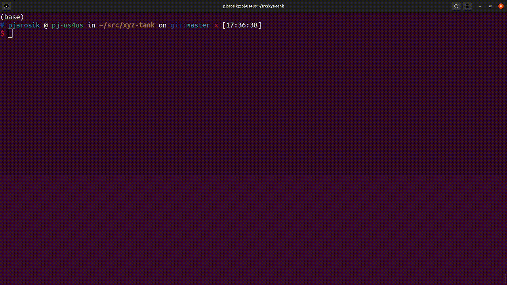
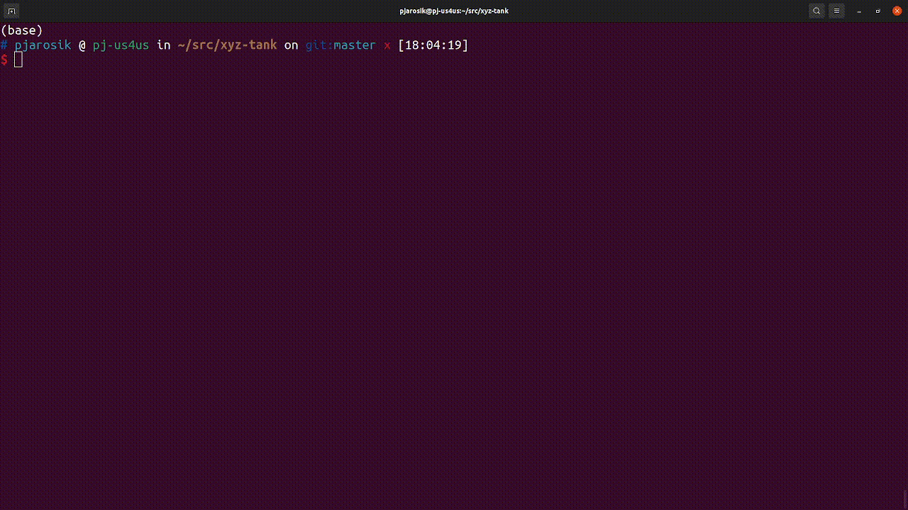
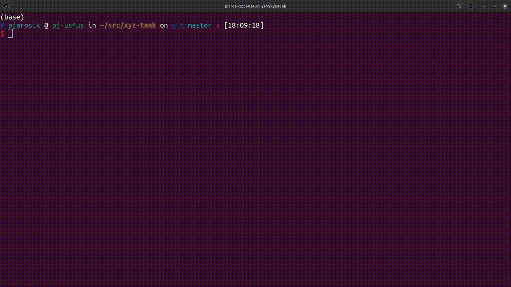

# XYZ-tank

Application to interact with XYZ-tank system.

## Requirements

Python >= 3.8

## Installation

```
git clone git@github.com:us4useu/xyz-tank.git
pip install -e ./xyz-tank
```

## Usage

Use `--help` for more information on the usage and the available parameters:
```
python -m xyztank --help
```

### Interactive mode

To run application in interactive mode, just call `xyztank` without any parameters:
```
python -m xyztank
```

Then choose options from the menu by pressing selected key ENTER.

Below is an example of a complete measurement in the interactive mode:



You can stop the system while the measurement plan is executed:



### Non-interactive mode

You can pass the path to the configuration fle directly in the terminal:

```
python -m xyztank --settings examples/basic.py --output test.pkl
```



### Measurement plan

Currently, the measurement plan can be specified in the configuration file.
For some examples, check the configuration files available in the 
`examples` directory.

## License

MIT License

## Acknowledgements

...